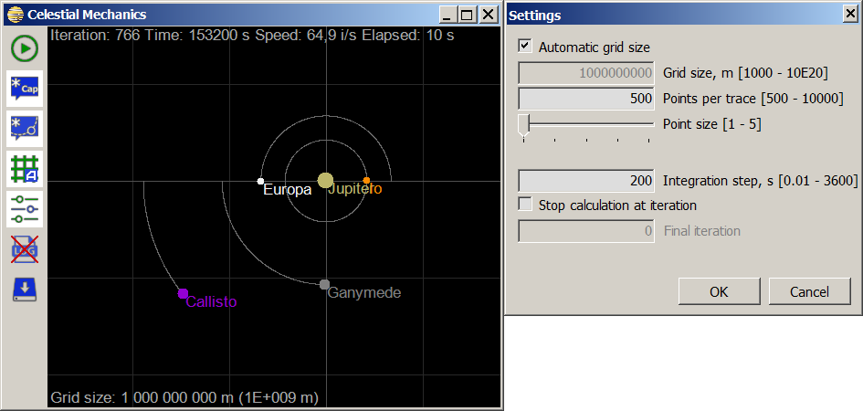

A simple `C#` (Windows Forms) application that simulates classical celestial mechanics using Jupiter and its four Galilean moons: Io, Europa, Ganymede and Callisto.

The simulation employs the Euler method within an object-oriented model to compute velocity vectors and celestial bodies' positions. While not suitable for high-precision research due to the algorithm's limitations, its simplicity makes it ideal for educational purposes.

You can download the executable file `Celestial.exe` on the [release page](https://github.com/ap13ski/Celestial-Mechanics/releases/tag/v.1.1). 

You may need to [install](https://www.microsoft.com/en-us/download/details.aspx?id=49982) `.NET Framework 4.6.1` to run the program as well ([mirror](https://github.com/ap13ski/Protractor/releases/download/v1.0/default.NET_Runtime_Pack_Offline_Installer_NDP461-KB3102436-x86-x64-AllOS-ENU.exe)).

Compiled with Visual Studio 2015 Community, .NET Framework 4.6.1.

Short demonstration [video](https://github.com/ap13ski/Celestial-Mechanics/blob/main/demo.mp4) is available (1.5 Mb):

https://github.com/user-attachments/assets/09499bcf-33fd-459d-a0ff-632ca05ee21b