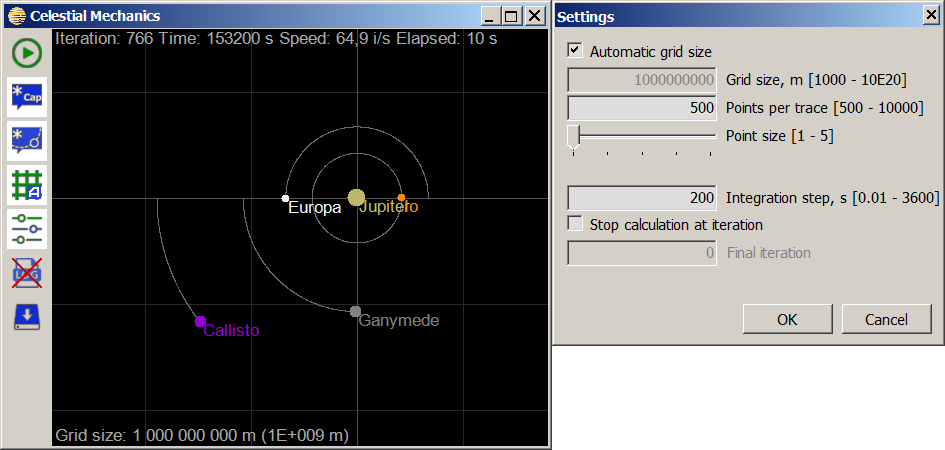

A simple `C#` program (Windows Forms) that implements classical celestial mechanics using Jupiter and the Galilean satellites (Io, Europa, Ganymede and Callisto) as examples. The program uses the Euler method to calculate velocity vectors and positions of the objects based on classes and methods of the vector algebra library (`Vector.cs`) and the particle library (`Particle.cs`).
The attempt has been made to solve the standard problem of celestial mechanics at a higher level of abstraction with the help of the object-oriented approach. This approach is not applicable to serious scientific calculations due to the low performance of the algorithm, but it is simple and understandable in terms of teaching celestial mechanics to schoolchildren and students, since the operations are performed on particles that have the properties of real celestial objects.

Visual Studio 2015, .NET Framework 4.6.1 

